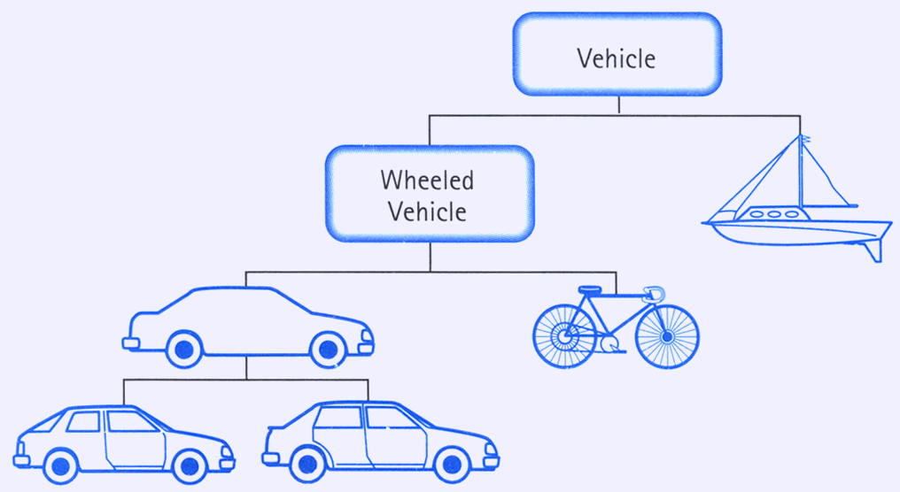

# Блок заданий по теме полиморфизм.

# Теоретическое задание (прочитать, запустить, ознакомиться с кодом)

## Что такое полиморфизм?


## А что делать если хочу расширить метод дочернего класса, при этом оставив функциональность родительского метода?


## Пример

Теперь рассмотрим более приближенный к реальности пример.

Допустим, у вас есть класс `Vehicle`, который описывает общее транспортное средство. 
В нашей упрощенной реализации разобьем дальнейшую иерархию на Лодку (`Boat`) и Колесное Транспортное Средство (`Wheeled Vehicle`).
`Wheeled Vehicle` далее можно разбить на Машину (`Car`) и Велосипед (`Bicycle`), а Машину разобьем на Купе (`Coupe`) и Седан (`Sedan`).

Данная иерархия носит исключительно информационный характер, остановимся на ней. 



А теперь реализуем это в коде (данный код приведен в файле `main.py`) 

```python
class Vehicle:
    """Базовый класс для всех транспортных средств."""
    def __init__(self, name):
        self.name = name

    def move(self):
        print(f"{self.name!r} передвигается")


class WheeledVehicle(Vehicle):
    """Класс для транспортных средств с колесами, наследуется от Vehicle."""
    def __init__(self, name, wheels):
        super().__init__(name)
        self.wheels = wheels

    def move(self):
        word = 'колесе' if self.wheels == 1 else 'колесах'
        print(f"{self.name!r} передвигается на {self.wheels} {word}")


class Car(WheeledVehicle):
    """Класс для автомобилей, наследуется от WheeledVehicle."""
    def __init__(self, name):
        super().__init__(name, 4)

    def open_trunk(self):
        print(f"Багажник машины класса {self.__class__.__name__!r} названия {self.name!r} открыт")


class Sedan(Car):
    """Класс для седанов, наследуется от Car."""
    def __init__(self, name):
        super().__init__(name)

    def describe(self):
        print(f"{self.name} является типом Седан")


class Coupe(Car):
    """Класс для купе, наследуется от Car."""
    def __init__(self, name):
        super().__init__(name)

    def describe(self):
        print(f"{self.name!r} является типом Купе")


class Bicycle(WheeledVehicle):
    """Класс для велосипедов, наследуется от WheeledVehicle."""
    def __init__(self, name):
        super().__init__(name, 2)

    def ring_bell(self):
        print(f"{self.name!r} прозвенел в звонок")


class Boat(Vehicle):
    """Класс для лодок, наследуется напрямую от Vehicle."""
    def __init__(self, name):
        super().__init__(name)

    def anchor(self):
        print(f"{self.name!r} поставлен на якорь")


if __name__ == "__main__":
    # Создание объектов и вызов методов
    sedan = Sedan("Toyota Camry")
    sedan.move()  # 'Toyota Camry' передвигается на 4 колесах
    sedan.open_trunk()  # Багажник машины класса 'Sedan' названия 'Toyota Camry' открыт
    sedan.describe()  # Toyota Camry является типом Седан

    bike = Bicycle("Mountain Bike")
    bike.move()  # 'Mountain Bike' передвигается на 2 колесах
    bike.ring_bell()  # 'Mountain Bike' прозвенел в звонок

    boat = Boat("Sailboat")
    boat.move()  # 'Sailboat' передвигается
    boat.anchor()  # 'Sailboat' поставлен на якорь
```
